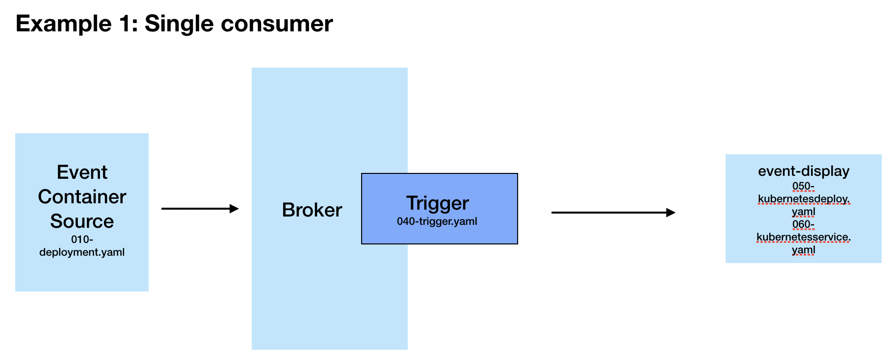

# Knative Eventing - Streaming Blockchain Transactions as CloudEvents
This project explores Knative Eventing. The aim of the project is to show a how a stream of events can be consumed using Knative Eventing. In this tutorial, you will deploy a go application that streams messages to a Knative broker. A service (event display) can subscribe to the events and they can be displayed in real time via a UI. 

The message stream source is the blockchain.info WebSocket API and sends information about new bitcoin transactions in real-time. You can find more information about this service [here](https://www.blockchain.com/api/api_websocket).

This demo will be built out over time to include multiple consumer services, however for now we have one source, a broker, trigger and one consumer/subscriber. In the case where you only have one consumer/subscriber, you can also sink straight to there (in this case that would be the event-display service). However, as it is the hope that this tutorial will be extended to include multiple, the broker and trigger will be used.

Below is a diagram of this initial version:



In order to run this demo, you will need:

- A Kubernetes cluster (a single node cluster running on Docker desktop is fine and is used to build this example)
- kubectl
- Istio installed (or another Gateway provider such as Gloo)
- Knative installed (instructions below)

## Installing Knative 

To install Knative, you can follow their online instructions or you can run the ```install_knative.sh``` script included in this repo. This will do a complete install of Knative Serving, Eventing and Monitoring. For a lighter install, you can follow the below instructions for Docker Desktop [here](https://knative.dev/docs/install/knative-with-docker-for-mac/).


To confirm your install is complete, you can run the following command:

```kubectl get pods --all-namespaces```

You should have namespaces for ```istio-system```, ```knative-eventing```, ```knative-serving``` (and ```knative-monitoring``` if you have installed using the install script).

You can also see the components deployed by running:

```kubectl get pods -n <namespace>```

## Building the Docker image

The Docker images are already available for the event display service in this tutorial, however if you want to make your own then you can build yourself. The files for the Event Source are at the following [link](https://github.com/josiemundi/blockchain-websocket-cloudevents) if you would also like to build your own image for the 010-deployment. 

To build a container image you will need to ensure you have a Dockerfile (there is one in this repo, which I used for building the image we deploy) and then from the directory where it is located, you can run the following commands (ensure you are also logged into your image repo account e.g Dockerhub):

example to build:

```docker build -t username/bitcoinfrontend .```

example to push: 

```docker push username/bitcoinfrontend```

## Run the yaml scripts

There are 4 main yaml scripts that need to be run to get this tutorial working.

```001-namespace.yaml``` - This creates a new namespace and also adds a knative-eventing injection label, which in turn creates a default broker. The image used is on Docker hub, however if you want to build your own then you can find the application files and Dockerfile in [this](https://github.com/josiemundi/knative-eventing-websocket-source) repo.

```010-deployment.yaml``` - This deploys a Kubernetes application (written in Go), which connects to the blockchain websocket stream and sends the messages to the broker.

```040-trigger.yaml``` - This specifies that all messages that come to the default broker should be sent to the Event Display service.

```050-kubernetesdeploy.yaml``` - This is a Kubernetes app deployment for consuming the CloudEvents and serving them at a front-end UI. 

```060-kubernetesservice.yaml``` - This file defines a Kubernetes service in order to specify the requirements of our Event Display application. It includes the ports needed to run the application and also sets it to be accessible on NodePort 31234 (you can change this if you want). 

Knative serving does not currently allow multiple ports so the Event Display part is a Kubernetes deployment (consisting of two files; 050 & 060). This is because we need to expose both 8080 (to receive the events) and 9080 (to serve the events). 


### Set up namespace and verify broker is ready

First ```kubectl apply -f 001-namespace.yaml``` This will deploy the ```knative-eventing-websocket-source``` namespace and enable the knative-eventing injection. 

Verify that the default broker is ready by running ```kubectl get broker -n <namespace>``` and you should see that the default broker has a status of READY=True. 

### Deploy application, trigger and event-display service

Run the following:

```kubectl apply -f 010-deployment.yaml``` This deploys the application as a Kubernetes app deployment. It declares the sink as the default broker within the relevant namespace. 

```kubectl apply -f 040-trigger.yaml``` This is our Knative eventing trigger, which is where we specify which services would like to subscribe to which type of events. 

```kubectl apply -f 050-kubernetesdeploy.yaml``` This is our Kubernetes application deployment, which will subscribe to the events coming from our application and display them. 

```kubectl apply -f 060-kubernetesservice.yaml``` This is our Kubernetes service file to specify the necessary ports etc.

## Verifying messages:

You can use the following kubectl commands to verify the process at each stage. 

to see logs of app:

```kubectl --namespace knative-eventing-websocket-source logs -l app=wseventsource --tail=100```

to see logs of broker:

```kubectl --namespace knative-eventing-websocket-source logs -l eventing.knative.dev/broker=default --tail=100```

to see logs of services (amend name of pod):

```kubectl logs -n knative-eventing-websocket-source -f event-display```

## See events in UI:

Head to localhost:31234 and you should see the events in the UI

## Curl the service:

Alternatively you can just curl the service from the terminal window and you should see the stream of events. 

```curl http://localhost:31234/events```


 
